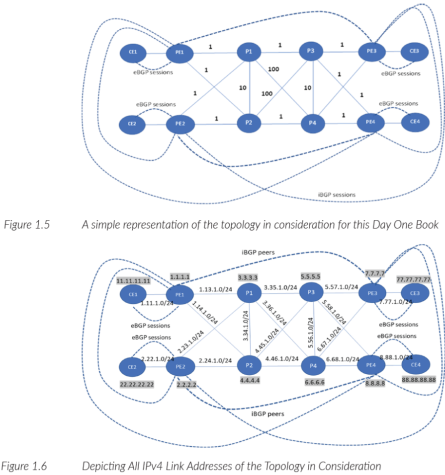

# Day One: Introduction to SRv6

This is the repo of the VMM Lab topology from the Juniper Networks Day One book on SRv6 - [Day One: Introduction to SRv6](https://www.juniper.net/documentation/en_US/day-one-books/DayOne-Intro-SRv6.pdf).

